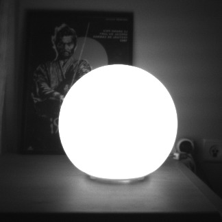
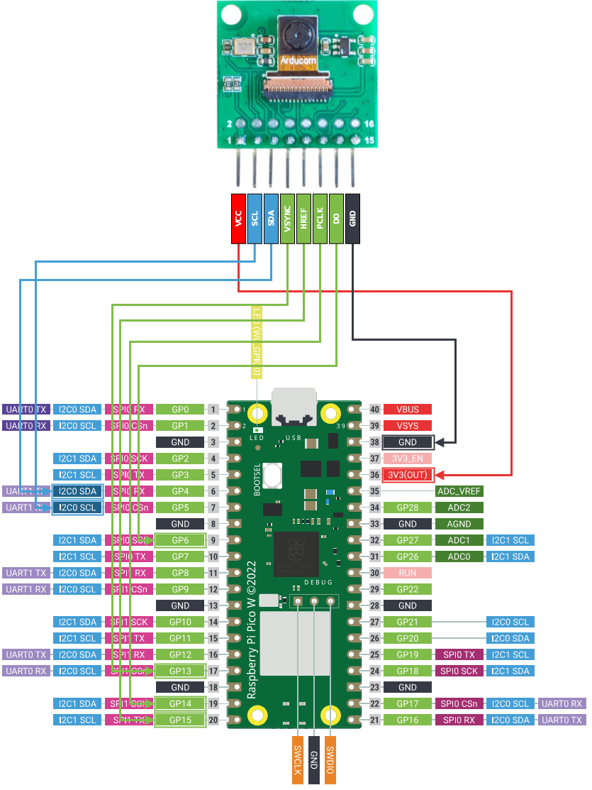
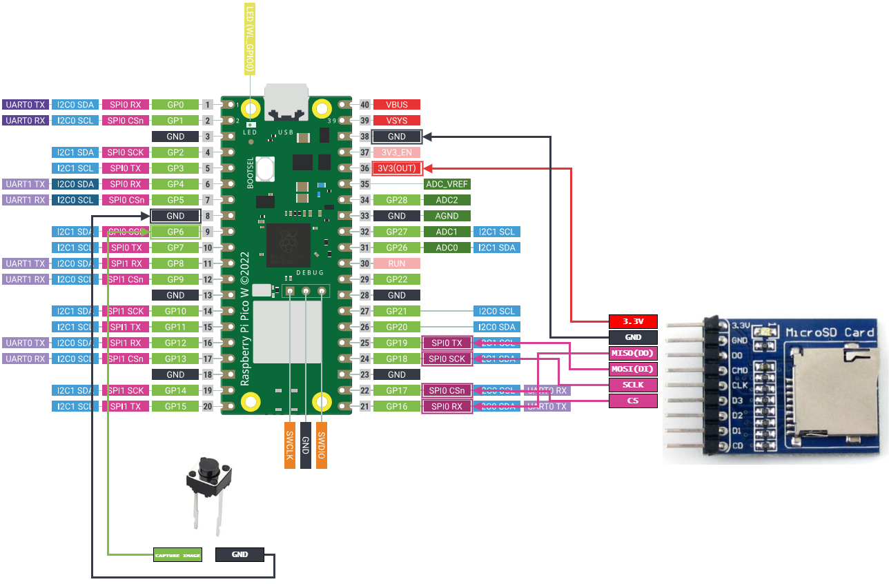

# Wireless Image Capture & Transfer with RP2040
## Description
This project enables wireless control of a camera module and image file transfer, using two RP2040 microcontrollers. It aims to create a lightweight and efficient system for remote visual monitoring using open-source software and minimal, low-cost hardware.

## Demo
Some images produced by the system are presented below. 

<figure style="text-align:center;">
  
  <figcaption style="text-align:center; font-size:20px;">My cat Nessie on my chair</figcaption>
</figure>

<figure style="text-align:center;">
  
  <figcaption style="text-align:center; font-size:20px;">A round lamp with a movie poster behind</figcaption>
</figure>

<figure style="text-align:center;">
  
  <figcaption style="text-align:center; font-size:20px;">An afternoon view</figcaption>
</figure>

## Components Used
The following components were used for the creation of this project:

* 2 Raspberry Pi Pico W Microcontroller Boards
* 2 Breadboards
* 1 Two-pin push button
* 1 Waveshare Micro SD(TF) Storage Board
* 1 Transcend 300S MicroSD 4GB Card
* 1 Arducam HM01B0 Monochrome QVGA SPI Camera Module
* Jumper Wires

## How It Works
Two RP2040 boards communicate wirelessly by configuring one as an Access Point (AP) and the other as a Station (STA). This allows the station to connect to the access point's Wi-Fi network, thus establishing a common network both microcontrollers are connected on. From this point forward, the station is referred to as the client and the access point as the server.

When a button is pressed on the client, an interrupt triggers the transmission of a UDP message to the server. Upon receiving the message, the server captures a frame from the camera module and saves it as an image file on its flash memory. This image is then sent back to the client in 81 UDP packets.

To mitigate packet loss, each packet is transmitted twice, increasing the likelihood of successful delivery.

The client reconstructs the image from the received packets and saves it to an external SD card in ```.pgm``` format, a simple image format compatible with most modern image viewers.

The system leverages both cores of each RP2040 microcontroller. One core handles network communication, while the other manages all remaining tasks, ensuring efficient parallel processing.

## Connectivity
The below tables and images describe exactly how each component is connected. Note that all of the connections can be reconfigured by changing the source code. These are just the default pins I picked.

### Server

| HM01B0 Camera Module | Client Board Pin |
| :------------------- | :--------------- |
| VCC                  | 3.3V(OUT)        |
| SCL                  | I2C0 SCL         |
| SDA                  | I2C0 SDA         |
| VSYNC                | GPIO Pin 13      |
| HREF                 | GPIO Pin 15      |
| PCLK                 | GPIO Pin 14      | 
| GND                  | Physical Pin 38 (or any GND pin) |

<figure style="text-align:center;">
  <figcaption style="text-align:center; font-size:24px;">Server Layout</figcaption>
  
</figure>

### Client

| 2-Pin Push Button | Micro SD(TF) Storage Board | Server Board Pin |
| :------------------------- | :--------------- | :--------------- |
| Pin 1 | - | GPIO Pin 6|
| Pin 2 | - | Physical Pin 8 (or any GND Pin) |
| - | 3.3V | 3.3V(OUT) |
| - | GND | Physical Pin 38 (or any GND pin) |
| - | MISO(DO) | SPI0 RX |
| - | MOSI(DI) | SPI0 TX |
| - | SCLK | SPI0 SCK |
| - | CS | SPI0 CSn|

<figure style="text-align:center;">
  <figcaption style="text-align:center; font-size:24px;">Client Layout</figcaption>
  
</figure>

## How To Build
If you are interested in trying out the project yourself, follow the steps listed below.

1. Make sure that the Pico C SDK is installed correctly, and that you can compile and flash the pico-examples.

2. Get the components listed in "Components Used", and connect them the way shown above in "Connectivity".

3. Open a terminal and run:

```
git clone --recurse-submodules https://github.com/PanagiotisKarath/PicoW-WirelessTempLogger
```

4. You should now have the a folder with the name of the repository. ```cd``` into that folder and run the following commands:
  ```
  mkdir build
  cd build
  cmake -DPICO_BOARD=pico_w ..
  make
  ```
  You can optionally write ```make -j4``` where 4 is the number of "jobs" the compilation is broken to. If you have a lot of cores/threads feel free to increase the number as to decrease the compilation time.

5. After the process is done, you can find the ```.uf2``` and ```.elf``` files in 
the build folder, which you then flash to the Pico microcontrollers. The ```.uf2``` files are used for flashing using the BOOTSEL button, while the ```.elf``` files using a Debug Probe. Specifically, flash ```access_point.uf2``` (or ```access_point.elf```) on the board which has the camera module connected (the server) and ```station.uf2``` (or ```station.elf```) on the board which has the button and the SD card module connected (the client).

If you are not interested in building the project, you can get the binaries (```.elf``` and ```.uf2``` files) from the "bin" folder.

## How To Use
After flashing the binaries, you are now ready to start capturing images. Make sure you insert an SD card in the SD card module, formatted in FAT32. I used a 4GB one and cannot guarantee that the system works with larger capacity cards. Next, supply the server with power **first**. After that, you can supply the **client** with power as well, and wait until the on-board LED on the client turns on. This indicates that it has connected to the server's network. Press the  button and wait for a few seconds for the image file to be transfered. After that remove the SD card and insert it in a PC. ```.pgm``` files are usually readable by default, if not look up for an online ```.pgm``` to ```.jpeg``` or ```.png``` converter.

## Projects Used
This project would not have been possible without the existence of these open-source projects. Make sure to give them a look.

* [lwIP](https://savannah.nongnu.org/projects/lwip/), used for the implementation of all networking aspects of the project.
* [pico-vfs](https://github.com/oyama/pico-vfs) which is a very interesting idea of a virtual file system for the Pico.